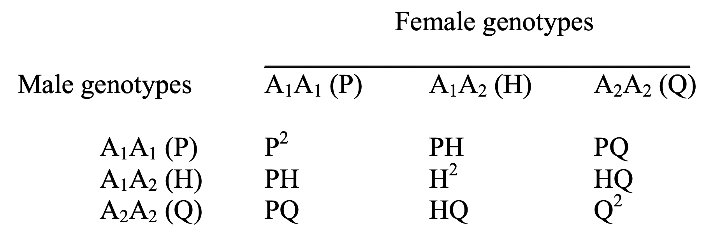
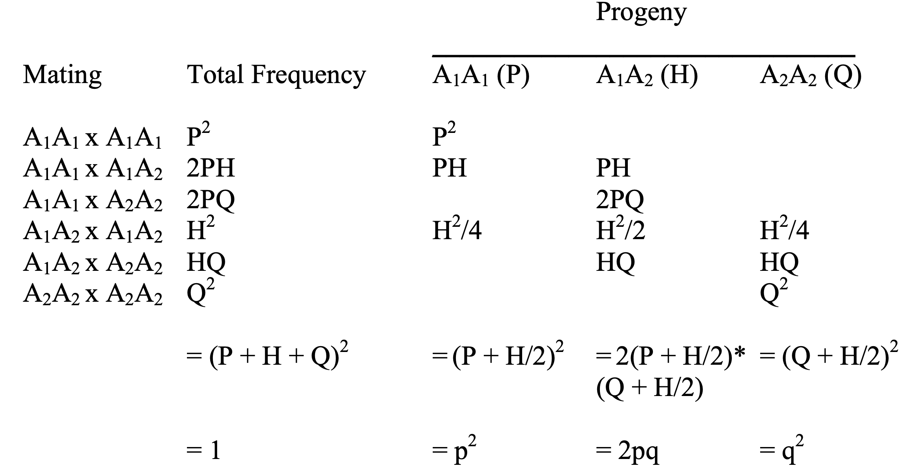

```{r setup, include=FALSE}
knitr::opts_chunk$set(echo = TRUE)

# load packages
library(adegenet)
library(hierfstat)
library(ggplot2)
```

## Learning goals

Understand:  

* what is the Hardy-Weinberg (HW) principle
* assumptions and utility in population genetics studies
* how population structure, admixture, finite populations, and data source can impact interpretation of tests for HW equilibrium

Be able to:  

* test for HW equilibrium
* estimate locus-by-locus FIS and mean FIS
* identify potential causes of deviations from HW equilibrium
* distinguish the Wahlund effect from inbreeding (the mating of individuals that are closely related through common ancestry)

## Learning self-assessment questions (before):
  
Describe in your own words, what is the Hardy-Weinberg principle?  
  
How might this principle be useful to you in understanding the health of a population of conservation concern?  
  
Can you think of a scenario where it might be difficult to interpret what is the level of inbreeding in a population sample you have genotyped based on estimates of heterozygosity and FIS alone?

# Background

## The Hardy-Weinberg (HW) principle
At Hardy-Weinberg equilibrium, (i) allele frequencies in a population will remain constant indefinitely, and (ii) genotypic proportions occur at Hardy-Weinberg proportions in the population as determined by the “square law”. 

What is the “square law”? Think of the Punnett Square you learned about in introductory genetics. Consider a single locus with two alleles A1 and A2. 

Let:	
  p = frequency of A1 allele  
  q = frequency of A2 allele

Three genotypes are thus possible: A1A1, A1A2, and A2A2. 
  
Let:  
  P = frequency of A1A1 homozygote  
  H = frequency of A1A2 heterozygote  
  Q = frequency of A2A2 homozygote\newline
  
From the frequencies, we can estimate allele frequencies:   
  p = P + ½ H  
  q = Q + ½ H\newline
  
These frequencies will sum to 1, since there are only 2 alleles present:  
  p + q = 1\newline  
  
If mating occurs at random in the population, what will be the frequencies of A1 and A2 in the next generation? It depends on the frequencies of each genotype in the parents:
```{r echo=FALSE, out.width='50%'}

```
  
The progeny produced by this set of matings would be:
```{r echo=FALSE, out.width='70%'}

```
  
The frequencies of the alleles have not changed, and the genotypic proportions are determined by the “square law”. For two alleles, genotypic proportions are given by expanding the term (p+q)^2.

## Assumptions of the HW principle

The reason the Hardy-Weinberg equilibrium is so important is that for evolutionary change to occur in a population, it is necessary for one or more specific assumptions to be violated. We can use information about the way the population deviates from HW expectations to understand which assumptions have been violated (and thus the relative importance of different forces of evolutionary change). What are these assumptions?

1)	Generations are discrete (i.e. non-overlapping)
2)	The species is diploid
3)	Reproduction is sexual
4)	The gene being considered has 2 alleles
5)	Allele frequencies are the same in males and females
6)	Mating is random
7)	The population size is infinite (i.e. no genetic drift)
8)	There is no migration (gene flow)
9)	There is no mutation
10)	There is no selection

## The fixation index (FIS) and interpretation

Since the Hardy-Weinberg principle predicts that no evolution will occur unless one of the above assumptions is violated, it is often useful to test if a population is in HW equilibrium and use information about the way the population deviates from HW expectations to understand which assumptions have been violated. In other words, deviations from HW expectations can help to determine the relative importance of random drift, migration, mutation, and natural selection in affecting the frequency of genetic polymorphism in natural populations. 

FIS (Nei, 1987) provides a simple way of summarizing in what direction the frequency of genetic polymorphism in natural populations deviate from HW equilibrium. FIS is based on a comparison of observed heterozygosity (Hobs) and the HW expected heterozygosity (Hexp) given the allele frequencies in the population:

FIS = 1 - (Hobs/Hexp)\newline
  
**Negative FIS indicates a homozygote deficit and heterozygote excess. Some of many potential causes of heterozygote excess include:**   

* Small population size, this is because allele frequencies are likely to differ between sexes just due to chance.
* Negative assortative mating when reproduction occurs between individuals bearing phenotypes more dissimilar than by chance.
* Heterozygote advantage, something that sometimes occurs in hybrid zones
* Selection, this can occur in cases of balancing selection, but usually occurs in only a small proportion of the genome.
* See the list of assumptions and let your mind run!

**Positive FIS indicates a homozygote excess and heterozygote deficit. Some of many potential causes of heterozygote deficit include:**

* Inbreeding, this is because matings between close relatives are more likely to result in pairing even rare alleles in homozygote form.
* Population structure, this is because of the “Wahlund effect”, where two or more subpopulations are in Hardy-Weinberg equilibrium but have different allele frequencies such that the overall heterozygosity is reduced compared to if the whole population was in equilibrium.
* Selection, this can occur in cases of directional selection because alleles that have a selective advantage are more likely to be in homozygous than heterozygous form. Note that these alleles are also more likely to go to fixation unless there is clinal variation, frequency-dependence, or other processes that maintain both alleles.
* Technical issues, for example miss-scoring of heterozygotes as homozygotes because of low next-gen sequencing read depth.
* See the list of assumptions and think through the logical consequences!

# In-Class Activity

# Part 1: Four Scenarios. 
You will be split into 4 working groups (breakout rooms) A-D. Each group will be blindly assigned one of four datasets, and it is your goal to perform several analyses on these datasets and identify which dataset your group received.\newline

Four Scenarios:  \newline
1)	Marten dataset from the admixture zone in Idaho  
2)	Marten dataset from a healthy population north of the admixture zone  
3)	Bull trout SNP dataset with very small Ne  
4)	Rainbow trout SNP dataset from a genome-wide association study  \newline

Within your breakout group, determine which of the scenarios you have, use the R package “hierfstat” following the code provided in Part 1 of HW_student.Rmd to estimate and plot basic statistics including FIS, and answer the following question (also listed in the Rmd file, feel free to type into the Rmd save it for your records):\newline

```{r FIS}
# import data in genepop format as "myData"
myData <- read.genepop("HW_FourScenarios.gen", ncode = 2 , quiet = TRUE)

# fill in "pop" slot of genind object with proper dataset A-D
pop_list <- as.factor(c(rep("A",25),rep("B",25),rep("C",25),rep("D",25)))
myData@pop <- pop_list

# use hierfstat to get basic stats and FIS per locus, "E" is for example, change to "A", "B", "C", or "D"
statsA <- basic.stats(myData[myData@pop == "A"])
statsB <- basic.stats(myData[myData@pop == "B"])
statsC <- basic.stats(myData[myData@pop == "C"])
statsD <- basic.stats(myData[myData@pop == "D"])
```
Students will want to take a look at the basic stats output.
```{r include=FALSE}
# print the output
statsA
statsB
statsC
statsD
```

## Question 1: What is the first table? What are some trends that you see in the data?\newline

## Question 2: What is the second table? What is the overall expected heterozygosity, observed heterozygosity, and FIS in this dataset?\newline

```{r plot FIS results per locus, eval = FALSE}
# plot the FIS per locus, remember to change "E" to match your assigned scenario
plot(statsA$perloc$Fis,main="Scenario A",xlab = "locus", ylab = "Fis")
abline(h=statsA$overall[9],col="red")

# plot the FIS per locus, remember to change "E" to match your assigned scenario
plot(statsB$perloc$Fis,main="Scenario B",xlab = "locus", ylab = "Fis")
abline(h=statsB$overall[9],col="red")

# plot the FIS per locus, remember to change "E" to match your assigned scenario
plot(statsC$perloc$Fis,main="Scenario C",xlab = "locus", ylab = "Fis")
abline(h=statsC$overall[9],col="red")

# plot the FIS per locus, remember to change "E" to match your assigned scenario
plot(statsD$perloc$Fis,main="Scenario D",xlab = "locus", ylab = "Fis")
abline(h=statsD$overall[9],col="red")
```
## Question 3: When you look at the per-locus FIS, does anything stand out to you? Are there any loci that appear to be outliers?\newline

## Question 4: If so, what are some possible interpretations of what may have caused this deviation for expected levels of heterozygosity?\newline

## Question 5: Do you think there is an overall heterozygote excess or defecit (or neither) in this dataset? What are some possible interpretations of this result?\newline

## Question 6: Is there an obvious alternative interpretation of the pattern of FIS you observed that you are left unable to distinguish with the available information? What might you do to test this alternative hypothesis?\newline

When you have completed these questions, as a group prepare a few sentences that describe which scenario you think your group was assigned, and why you think this. Then return to the main room to share with the other groups.\newline 

# Part 2: The Wahlund effect. 
 
How can we distinguish population structure from inbreeding (high overall FIS)? Together, we will produce two different simulated datasets, then you will again break off into groups to complete some analysis and answer some questions to allow you to distinguish population structure from inbreeding in an idealized situation. This activity should also give you some strategies to consider in the real world when you encounter patterns of deviation from Hardy-Weinberg equilibrium.

Together, we will look at the PCA and clustering plots from two different simulated datasets:  
1) high overall FIS because of inbreeding  
2) high overall FIS because of population structure  \newline

First, let's simulate inbreeding:\newline
```{r simulate inbreeding with heirfstat}
# simulate inbreeding
iSim <- sim.genot(size=100,nbal=8,nbloc=15,nbpop=1,N=1000,mut=0.001,f=0.2) # simulate
colnames(iSim) <- NULL # replace column names with null to make adegenet happy
iData <- df2genind(iSim[-1], ncode=1) # convert to adegenet genind object
iData@pop <- as.factor(rep("Inbreeding",100)) # fill in "@pop" of genind object (for hierfstat)
```

Now, let's simulate restricted gene flow (population structure):\newline
```{r simulate restricted gene flow with heirfstat}
# simulate population structure dataset
sSim <- sim.genot.metapop.t(size=50,nbal=8,nbloc=15,nbpop=2,N=50,
      mig=matrix(c(1,0,0,1),nrow=2,byrow=TRUE),f=0.01,mut=0.01,t=1000) # simulate
colnames(sSim) <- NULL # replace column names with null to make adegenet happy
sData <- df2genind(sSim[-1], ncode=1) # convert to adegenet genind object
sData@pop <- as.factor(rep("Structure",100)) # fill in "@pop" of genind object (for hierfstat)
```

## Question 7: What are the major parameter choices for the simulation of both datasets? Is there anything you would change with less limited computation time?\newline

Within your breakout group, use the R package “hierfstat” following the code below to estimate and plot basic statistics including FIS, and visualize the genetic structure present in the simulated datasets. Then answer the following question (also listed in the Rmd file, feel free to type into the Rmd save it for your records):\newline
```{r view basic stats for each, out.width='50%'}
# basic stats
iStats <- basic.stats(iData)
iStats 
sStats <- basic.stats(sData)
sStats 

# FIS plots 
plot(iStats$perloc$Fis,xlab = "locus", ylab = "Fis", main = "Inbreeding")
abline(h=iStats$overall[9],col="red")
plot(sStats$perloc$Fis,xlab = "locus", ylab = "Fis", main = "Structure")
abline(h=sStats$overall[9],col="red")
```

## Question 8: Do you think there is an overall heterozygote excess or defecit in these two datasets? What do you think caused this excess/deficit in each case?\newline

## Question 9: Are there any obvious differences between the output for these different simulations? What can we do to distinguish between the possible causes (population structure and inbreeding)?\newline

One idea for this is to run a principal component analysis on the simulated genotypes and visualize (plot) the eigenvectors to see how the individuals cluster...Is there any population structure?\newline

First let's plot the PCA eigenvalues and eigenvectors from the simulation with inbreeding:\newline
```{r PCA with adegenet, out.width='50%'}
# PCA for simulation with inbreeding
iPCA <- dudi.pca(iData,cent=FALSE,scale=TRUE,scannf=FALSE,nf=4)
barplot(iPCA$eig[1:50],main="PCA eigenvalues", col=heat.colors(50)) # view eigenvalues
s.label(iPCA$li) # plot eigenvectors
```

Now, let's plot the PCA eigenvalues and eigenvectors from the simulation with restricted gene flow:
```{r PCA with adegenet structured, out.width='50%'}
# PCA for structured
sPCA <- dudi.pca(sData,cent=FALSE,scale=TRUE,scannf=FALSE,nf=4)
barplot(sPCA$eig[1:50],main="PCA eigenvalues", col=heat.colors(50)) # view eigenvalues
s.label(sPCA$li)
```

## Question 10: Do you see the population structure in the one dataset and not the other? What other analysis would you want to do if this were your own thesis to prove to yourself there is population structure rather than inbreeding?\newline

One idea here is to estimate FIS again after separating these putative clusters. Does the signal of FIS go away?

```{r basic stats for separate clusters of structured dataset, out.width='50%'}
grpA <- sData[sPCA$li$Axis2>0]
grpB <- sData[sPCA$li$Axis2<0]

# basic stats
aStats <- basic.stats(grpA)
aStats 
bStats <- basic.stats(grpB)
bStats 

# FIS plots 
plot(aStats$perloc$Fis,xlab = "locus", ylab = "Fis", main = "Structured - A")
abline(h=aStats$overall[9],col="red")
plot(bStats$perloc$Fis,xlab = "locus", ylab = "Fis", main = "Structured - B")
abline(h=bStats$overall[9],col="red")
```

## Question 11: After separating the dataset into two clusters and estimating FIS again for each putative cluster, does the signal of high FIS go away? Why/why not?\newline

To illustrate what would happen if the underlying cause really were FIS not structured populations, we can run the same analysis with the simulation with inbreeding:
```{r basic stats for forced clustering from inbred simulation, out.width='50%'}
grpC <- iData[iPCA$li$Axis2>0]
grpD <- iData[iPCA$li$Axis2<0]

# basic stats
cStats <- basic.stats(grpC)
cStats 
dStats <- basic.stats(grpD)
dStats 

# FIS plots 
plot(cStats$perloc$Fis,xlab = "locus", ylab = "Fis", main = "Inbreeding - C")
abline(h=cStats$overall[9],col="red")
plot(dStats$perloc$Fis,xlab = "locus", ylab = "Fis", main = "Inbreeding - D")
abline(h=dStats$overall[9],col="red")
```

## Question 12: This time, after separating the dataset artificially into two clusters and estimating FIS again for each putative cluster, does the signal of high FIS go away? Why/why not?\newline

## Question 13: Can you imagine a scenario where it may be difficult to distinguish the cause of a high value of FIS? What might this be?\newline

```{r In case anyone wants to veiw the PCA in more detail, out.width='50%'}

# Assign the PCA you want to plot: Structured simulation
pca1 <- sPCA

# calculate percent variance of each component:
pc1 <- round(pca1$eig[1]/sum(pca1$eig)*100,digits=2)
pc2 <- round(pca1$eig[2]/sum(pca1$eig)*100,digits=2)

# define what you want to plot and create a dataframe:
PC1 <- pca1$li[,1]
PC2 <- pca1$li[,2]
df <- data.frame(PC1,PC2)

# plot:
ggplot(data = df, aes(PC1,PC2),)+
  xlab(paste("PC 1 (",pc1,"%)"))+
  ylab(paste("PC 2 (",pc2,"%)"))+
  geom_point(size=1.5)+
  ggtitle("PCA of structured simulation")+
  theme(panel.grid.major = element_line(colour = "#856f2c"), panel.grid.minor = element_blank(), panel.background = element_rect(fill = "transparent", colour = NA), plot.background = element_rect(fill = "transparent", colour = NA), legend.key = element_blank(), legend.title = element_blank(), axis.line = element_line(colour = "black"), aspect.ratio = 1)


# Assign the PCA you want to plot: Inbreed simulation
pca1i <- iPCA 

# calculate percent variance of each component:
pc1i <- round(pca1i$eig[1]/sum(pca1i$eig)*100,digits=2)
pc2i <- round(pca1i$eig[2]/sum(pca1i$eig)*100,digits=2)

# define what you want to plot and create a dataframe:
PC1i <- pca1i$li[,1]
PC2i <- pca1i$li[,2]
dfi <- data.frame(PC1i,PC2i)

# plot:
ggplot(data = dfi, aes(PC1i,PC2i),)+
  xlab(paste("PC 1 (",pc1i,"%)"))+
  ylab(paste("PC 2 (",pc2i,"%)"))+
  geom_point(size=1.5)+
  ggtitle("PCA of inbreeding simulation")+
  theme(panel.grid.major = element_line(colour = "#856f2c"), panel.grid.minor = element_blank(), panel.background = element_rect(fill = "transparent", colour = NA), plot.background = element_rect(fill = "transparent", colour = NA), legend.key = element_blank(), legend.title = element_blank(), axis.line = element_line(colour = "black"), aspect.ratio = 1)
```

# Learning self-assessment questions (after):

Describe in your own words, what is the Hardy-Weinberg principle?

How might this principle be useful to you in understanding the health of a population of conservation concern?

Can you think of a scenario where it might be difficult to interpret what is the level of inbreeding in a population you have genotyped a sample from based on estimates of heterozygosity and FIS alone?

Did this activity improve your ability to answer these questions?

Did this activity improve your overall understanding of the utility of the Hardy-Weinberg principle? If so, how so?

# References 

Nei M. (1987) Molecular Evolutionary Genetics. Columbia University Press

This material drew inspiration and lecture note material from my Ph.D. advisor Dr. Grant Pogson’s “Population Genetics” course from UC Santa Cruz, Spring Quarter, 2009.

